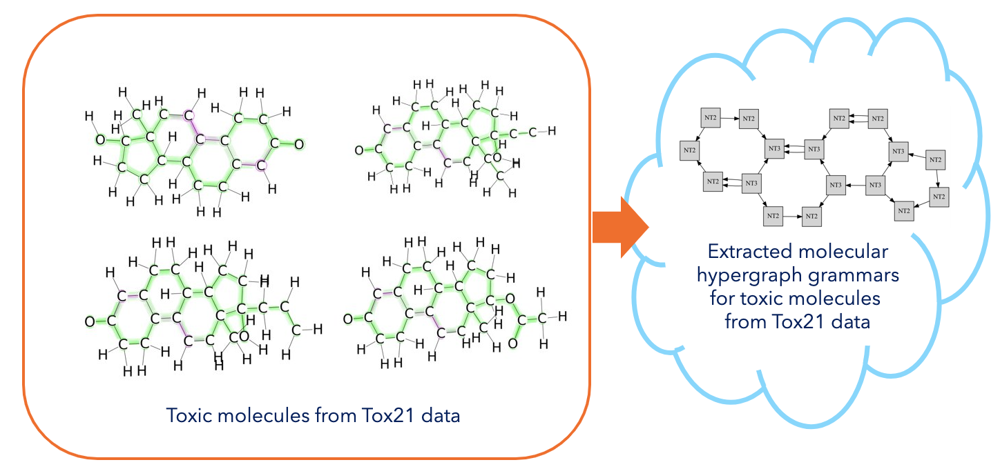
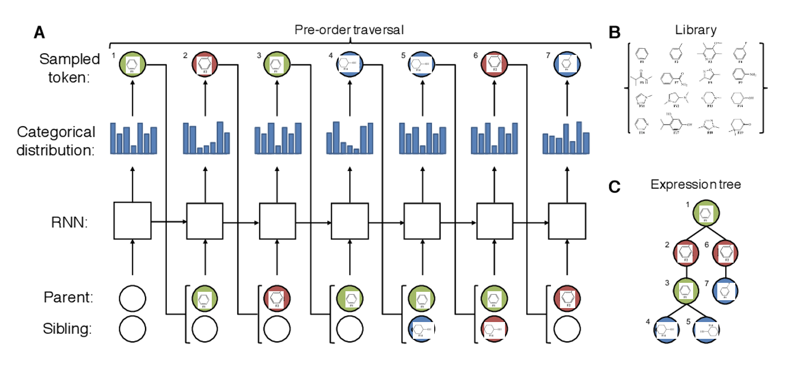

#### Three expected direction of work
-   Visual Explanation Evaluation Framework
-   Junction Tree-based Structural Explanation of Molecular Graph Neural Networks
-   Molecular Hypergraph based deep symbolic RL framework for molecular graph understanding

#### 1. Visual Explanation Evaluation Framework
Abstract [TODO]

#### 2. Junction Tree-based Structural Explanation of Molecular Graph Neural Networks
Abstract [TODO]

#### 3. Molecular Hypergraph based deep symbolic RL framework for molecular graph understanding
Molecular Hypergraph is the model to extract graph grammar encoding the hard chemical constraints, called molecular hypergraph grammar (MHG), from dataset.

Kajino, Hiroshi. "Molecular hypergraph grammar with its application to molecular optimization." International Conference on Machine Learning. PMLR, 2019.

- [paper: Hiroshi et al.](https://proceedings.mlr.press/v97/kajino19a.html)
- [github for the model](https://pages.github.com/) 

Elablorating this model, we are working along the two directions of explorative reserach.

- **Explaining Chemical rules to lead properties using MHG:**
 Postanalysis of the set of molecular hypergraph grammars (MHG) extracted from specific set of molecules, such as toxic drugs, high energy-bandgap molecules. Through quanlitative and quantivative analysis of extracted MHG, there are possibilities to discover scientific insights to make the proporties of the target dataset we are using.

- **Generating new molecules with target properties using RL:**
 Capability to decompose target molecule to tree structure opens many possibility to learn molecular representation by formulating tree as a seqence of nodes. As any tree structure can be traversed and represented as the sequence of nodes, we can elaborate reinforcement learning in a way that RL agent guide the process to generating sequence of nodes.
The idea is, first we generate sequence of nodes using models, such as RNNs, LSTMs or GRU, and convert tree (sampled seqeuce of nodes) to molecular graph (molecule), secondly, based on the generated molecular graph (molecule), we compute the target property of generated molecule using data-driven surrogate function (such as [GCN](https://www.mdpi.com/1422-0067/20/14/3389), [MPNN](https://arxiv.org/pdf/1704.01212.pdf) or [Transformer](https://chemrxiv.org/engage/chemrxiv/article-details/60c7588e469df48597f456ae) based) or physics driven simulator (such as such as [ChemSketch or Avogadro](https://www.sculpteo.com/en/3d-learning-hub/3d-printing-software/molecular-modeling-software/).).   
- Basecode: [Deep Symbolic Optimization](https://github.com/brendenpetersen/deep-symbolic-optimization)

